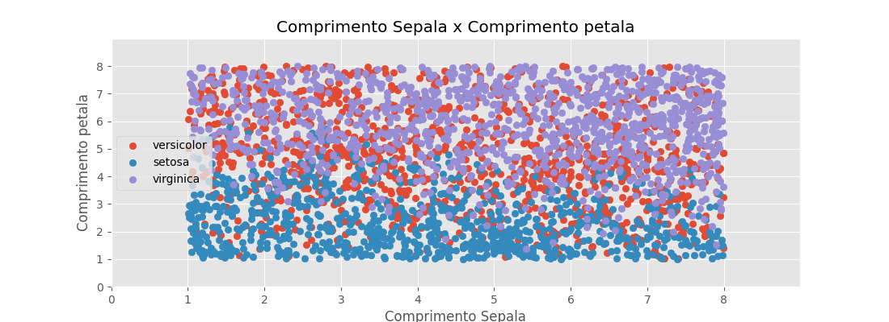
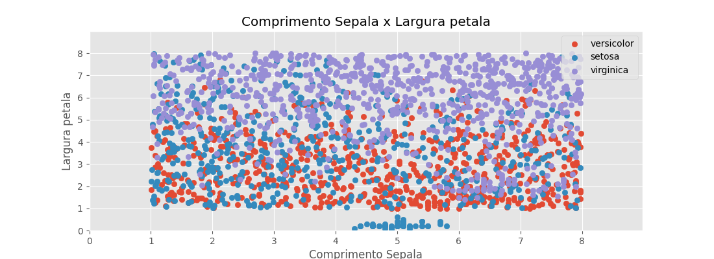
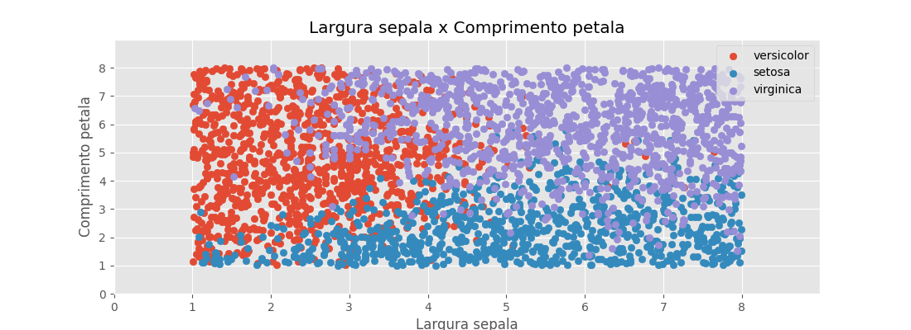
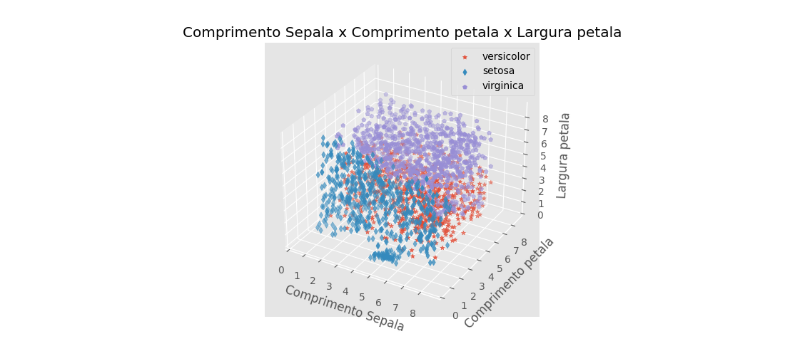

# Inteligência artificial (KNN)

## Sumário
1. Apresetação
2. Introdução
3. Objetivo
4. Dilema
5. Confecção

    -5.1 Treinamento

        -5.1.1 Função Gamma

        -5.1.2 Função Theta

        -5.1.3 Função Omega

        -5.1.4 Matriz de confusão 

    -5.2 Análise Gráfica

    -5.3 Novos vetores


1. Conclusão
---

## 1. [Apresentação](https://en.wikipedia.org/wiki/K-nearest_neighbors_algorithm)
>O modelo de KNN é um método de apendizado supervisionado não paramétrico, desenvolvido pela primeira vez por  [Evelyn Fix (ref. 1.1)](https://en.wikipedia.org/wiki/Evelyn_Fix) e [Joseph Hodges (ref. 1.2)](https://en.wikipedia.org/wiki/Joseph_Lawson_Hodges_Jr.) em 1951 e posteriormente expandido por [Thomas M. Cover (ref. 1.3)](https://en.wikipedia.org/wiki/Thomas_M._Cover). É usado para classificação e regressão. Em ambos os casos, a entrada consiste nos k exemplos de treinamento mais próximos em um conjunto de dados . A saída depende se k -NN é usado para classificação ou regressão.


---

## 2. Introdução
    
---
## 3. Objetivo
    Criar uma inteligência artificial baseada no modelo KNN (K-Nearest Neighbors), para a identificação de espécies distitas de iris.

        - Iris Versicolor
        - Iris Virginica
        - Iris Setosa


    Para a confexão do projeto, foi proposto o uso da distância euclidiana que segue a seguinte forma:


Sejam dois objetos: $X_1 = (x_{11}, x_{12},\dots, x_{1n})$ e $X_2 = (x_{21}, x_{22},\dots, x_{2n})$ a distância entre tais pontos é dada pela fórmula da distância euclidiana entre tais pontos. Onde $X_1,X_2\in\mathbb{R}^{n}$ 
$$dist(X_1, X_2) = \sqrt[]{\sum_{i=1}^n{(X_1i-X_2i)^{2}}}$$

[Referêcia 3.1](https://pt.wikipedia.org/wiki/Distância_euclidiana#:~:text=Em%20matemática%2C%20distância%20euclidiana%20é,torna-se%20um%20espaço%20métrico.)


## 4. Dilema

>Tal processo se mostrou redundante, visto que realizava diversos passos desnecessários e que muitas vezes prejudicavam uma previsão mais precisa. Para contornar o problema, mostrou-se necessário uma quebra de paradigma. Deixando a teoria de Euclides de lado e partindo para um conceito novo.
---
## 5. Confeção - treinamento
----

### 5.1.1 Função Gamma $\Gamma(X)$

- A função Gamma cria um lambda com a média das normas dos vetores mais próximos a um novo ponto quaisquer.
---

Sejam
$\lambda_{ij}, X = (x_1, \dots, x_2)\in\mathbb{R^{n}}$, $a, b = 0$ 

E a função gama definida por
$$\Gamma(X) = \lambda=(\sum_{i=1}^{n}{(\sum_{j=1}^{len(X_i)}a+1, b+x_{ij})})$$
>Onde a soma de a só será realizada se e somente se Xij for diferente de zero, caso contrário, nada será feito.
A função Gamma fica completa com um passo a mais em cada interação do somatório primário. Passo a de uma forma nominal significa a o somátorio da média das normas presentes no X. Ou seja:

$$\lambda = \bigcup_{k=1}^{n}(a_i/b_i) \leftrightarrow b_i \neq 0$$

$$\dots b_1 = 0 \rightarrow \lambda_i = C$$

>De uma forma nominal, quando bi for igual a zero, a função acrescenta uma constante qualquer na matriz lambda para que snão interfira nas contas seguintes. Tal função foi escrita na linguagem python da seguinte forma:
---
```python
def ver2(x):
    lista = []
    for i in range(len(x)):
        sum = 0
        counter = 0
        for j in range(len(x[i])):
            if x[i][j] == 0.0:
                continue
            else:
                sum += x[i][j]
                counter += 1
        try:
            lista.append(sum/counter)
        except ZeroDivisionError:
            lista.append(10000)
    return lista    
```
---
### 5.1.2 Método Theta $\Theta(column)$
---
- Método Theta caso seja específicado uma coluna, organiza de forma crescenteos vetores colunas com base na coluna especificada e devolve o 3 matrizes. São elas: [mínimo de todas as espécies separados por caracteristica], [maximo de todas as espécies separados por caracteristica] e [desvio padrão de todas as espécies separados por caracteristicas].

---
        Caso 1: Coluna especificada:

Sejam $\gamma\in[0,1,2 ,3]$ e $\zeta = [X_1, X_2,\dots,X_n]\in \mathbb{R^{n}}$

$$step = [\bigcup_{i=1}^{n}[\bigcup_{j=1}^{\zeta_i}\zeta_i\leftrightarrow\zeta_i<\zeta_j\in\forall\zeta]]$$

$$\Theta(\gamma) = [[\bigcup_{i=1}^{n}min(step_i)], [\bigcup_{i=1}^{n} max(step_i)], [\bigcup_{i=1}^{n}std(step_i)]]$$

---
        Caso 2: Coluhna não específicada:

Seja $\zeta = [X_1, X_2, \dots, X_n]\in\mathbb{R^{n}}$
$$\Theta(X) = \zeta = \bigcup_{i=1}^{n}sorted(\zeta_i)$$

        Onde a função sorted organiza a matriz em ordem crescente.
---

Tal método fica do modo em python:

---
```python
def rearranges(self, command="norm"):
    match command:
        
        case "norm": 
            self.matrix = np.array([sorted(self.matrix[i]) for i in range(len(self.matrix))])

        case _:
            a = np.array([np.array([i.args_num[command] for i in self.matrix[j]]) for j in range(len(self.matrix))])
            return np.array([[np.min(a[i]) for i in range(len(a))], [np.max(a[i]) for i in range(len(a))], [np.std(a[i]) for i in range(len(a))]])
```

---

### 5.1.3 Método Omega $\Omega()$

Sejam 

$\varphi, \lambda, \tau,n,m\in\mathbb{R}$

$\nu,\rho\in\mathbb{R^{n}}$

$\epsilon(x):= \|x\|$

$\mu = (v.a._1,v.a._2,\dots, v.a._m)$

$\sigma := \nu_{\mu \lambda}$


$$
    \psi = \Gamma(\Theta,\bigcup_{j}^{\rho}[\bigcup_{k}^{j}[\sqrt{\sum[\bigcup_{l=0}^{\varphi}(\theta_{\sigma l})^{2}}\leftrightarrow \epsilon(\theta)-\tau <=\epsilon(k) <= \epsilon(\theta)+\tau]]])
$$

$\Omega := min(\psi)$
---
---
- Após o cálculo do psi, Omega busca qual dos componentes de psi é o minimo para a tomada de decisão. Ou seja: $$\Omega = min(\psi)$$. Com tal função, a máquina tem como acuraccy 95,1% com 33% do banco de dados para treinamento. Se mostrando eficiente com até 1% do banco de dados para treinamento, resultando em 90% de acuraccy.


---
```python
def prev(self):
    counter = 0

    while True:
        self.rearranges()
        teste = self.original_matrix[self.index[counter]]
        counter+=1
        m = ver2([[sum([(teste.lista(k)-j.lista(k))**2 for k in range(len(j.args_num)) if teste.fo()-self.norm_var <= j.fo() <= teste.fo()+self.norm_var])**(1/2) for j in i]for i in self.matrix])
    
        if ((m[0] < m[1]) & (m[0] < m[2])):
            if (teste.species != "versicolor"):
                self.falso_posi +=1
                self.dict["Versicolor"][f"{teste.species}"] += 1
                
            else:                    
                self.matrix[0].append(teste)
                self.dict["Versicolor"][f"{teste.species}"] += 1
                

        if ((m[1] < m[0]) & (m[1] < m[2])):
            if (teste.species != "setosa"): 
                self.falso_posi += 1
                self.dict["Setosa"][f"{teste.species}"] += 1

            else:                    
                self.matrix[1].append(teste)
                self.dict["Setosa"][f"{teste.species}"] += 1
            
        if ((m[2] < m[1]) & (m[2] < m[0])):
            if (teste.species != "virginica"):
                self.falso_posi +=1 
                self.dict["Virginica"][f"{teste.species}"] += 1
                
            else:
                self.matrix[2].append(teste)
                self.dict["Virginica"][f"{teste.species}"] += 1

                
        self.dict["Total"] += 1

        if (counter == len(self.index)):
                self.acuracy =1-(self.falso_posi/len(self.index))
                self.file(f"Teste numero: {self.now}   Falso positivo: {self.falso_posi}   Precisao: {self.acuracy}   tamanho indices:   {len(self.index)}   Total : {counter}   Tempo de execucao unitario: {datetime.now()-self.start}\n\n")


        if (counter == len(self.index)):
            self.acuracy =1-(self.falso_posi/len(self.index))
            self.total_analisado = len(self.index)
            break    
```

---


## 5.1.1 [Matriz de confusão](https://pt.wikipedia.org/wiki/Matriz_de_confusão)
> Resumidamente, matriz de confusão tem como objetivo mostrar os erros e acertos da inteligência artificial. A mesma mostra os acertos do processo na diagonal principal.
---

>Com testes relaizados com apenas 33% do banco de dados para treinamento, um padrão de erro se mostrou. Em grande parte dos casos, a matriz de confusão resultante tomava tal formato:

---
---
* Teste com 33% do banco de dados para treinamento (acuracy = 95%)

Espécie: | Virginica | Versicolor | Setosa| Total
-------|------|------|---------|----
**Virginica** | 12 | 1 | 0 | 13
**Versicolor** | 1 | 13 | 0 | 14
**Setosa** | 0 | 0 | 14| 14
|||||41

---

---
* Teste com 10% do banco de dados para treinamento (acuracy = 92,307%)

Espécie: | Virginica | Versicolor | Setosa| Total
-------|------|------|---------|----
**Virginica** | 5 | 1 | 0 | 6
**Versicolor** | 0 | 3 | 0 | 3
**Setosa** | 0 | 0 | 4| 4
|||||13

---
---

* Teste com menos de 10% do banco de dados para treinamento (acuracy = 90%)

Espécie: | Virginica | Versicolor | Setosa| Total
-------|------|------|---------|----
**Virginica** | 4 | 1 | 0 | 5
**Versicolor** | 0 | 2 | 0 | 2
**Setosa** | 0 | 0 | 3| 3
|||||10


### 5.2 Análise Gráfica

#### Triades de mesmos parâmetros:
##### Gráficos 2D com apenas o banco de dados 

---
*Comprimento sepala X Largura Sepala:*

---

33% do banco de dados para treinamentos (acuracy: 95,1%)

---

10% do banco de dados para treinamento (acuracy: 92,307%)

---

Menos de 10% do banco de dados para treinamento (acuracy: 90%)

---
---
*Comprimento Sepala X Comprimento Petala*

---

33% do banco de dados para treinamentos (acuracy: 95,1%)

---

10% do banco de dados para treinamento (acuracy: 92,307%)

---

Menos de 10% do banco de dados para treinamento (acuracy: 90%)

---
---
*Comprimento Sepala X Comprimento Petala*

---

33% do banco de dados para treinamentos (acuracy: 95,1%)

---

10% do banco de dados para treinamento (acuracy: 92,307%)

---
---

Menos de 10% do banco de dados para treinamento (acuracy: 90%)

---
---
*Largura Sepala X Comprimento Petala*

---

33% do banco de dados para treinamentos (acuracy: 95,1%)

---

10% do banco de dados para treinamento (acuracy: 92,307%)

---

Menos de 10% do banco de dados para treinamento (acuracy: 90%)

---
---
*Largura Sepala X Largura Petala*

---

33% do banco de dados para treinamentos (acuracy: 95,1%)

---

10% do banco de dados para treinamento (acuracy: 92,307%)

---

Menos de 10% do banco de dados para treinamento (acuracy: 90%)

---
---
*Comprimento Petala X Largura Petala*

---

33% do banco de dados para treinamentos (acuracy: 95,1%)

---

10% do banco de dados para treinamento (acuracy: 92,307%)

---

Menos de 10% do banco de dados para treinamento (acuracy: 90%)

---
---
>Diante dos parametros apresentados, não há uma diferenciação significativa entre os mesmos e suas diferenças entre as porcentagens de treinamento. Possiveis motivos: 

    - Má escolha de parametros para grafar
    - Mesmos falsos positivos
    - Por cada novo vetor ser considerado correto pela maquina
    o montante final tende a ser semelhante, pois, com uma base
    de treinamento baixa, a quantidade de falso positivo, não
    interfere na decisão da máquina.

---
---

##### Gráficos 2D com o banco de dados + 2 mil vetores aleatórios

>Por se tratar de 3 eventos aleatórios distintos que possuem em comum apenas a aleatóriedade e suas leis de formação, concluir algo se torna impreciso, porém podemos observar o padrão de decisão com base na base de treinamento.

>Obs.: Os gráficos de mesma porcentagem de treinamento, representam o mesmo evento aleatório, com a diferença única e exclusiva de parametros distintos.

>Obs.2: Sou daltônico e as cores não me ajudaram a analisar os gráficos.

---
*Comprimento Setala X Largura Setala*

---

33% do banco de dados para treinamentos (acuracy: 95,1%)

---

10% do banco de dados para treinamento (acuracy: 92,307%)


---

Menos de 10% do banco de dados para treinamento (acuracy: 90%)

---
> Na triade que grafa comprimento sepala X largura sepala, podemos notar que não há uma minimante divisão linear na representação dos dados de maior dimensão em espaço de menor dimensão. Entretanto nestes exemplos, é notável que a versicolor esta mais concentrada na parte inferior do gráfico, viriginica mais ao centro e setosa mais ao topo dos gráficos. Tal comportamento fica mais evidente no gráfico do evento que usou apenas 10% do banco de dados para treinamento.
---
---
*Comprimento Setala X Comprimento Petala*

---

33% do banco de dados para treinamentos (acuracy: 95,1%)

---

10% do banco de dados para treinamento (acuracy: 92,307%)

---

Menos de 10% do banco de dados para treinamento (acuracy: 90%)

---
> Nesta triade que grafa comprimento sepala X comprimento petala. O padrão mais notável é que a versicolor tem maior concentração acima da diagonal princial do gráfico; Setosa na parte inferior do mesmo e a Virginica do centro para cima. Como tais gráficos representam dados de maiores dimensões não é possivel analisar com mais precisão.

---
*Comprimento Setala X Largura Petala*

---

33% do banco de dados para treinamentos (acuracy: 95,1%)

---

10% do banco de dados para treinamento (acuracy: 92,307%)

---

Menos de 10% do banco de dados para treinamento (acuracy: 90%)

---
> Da mesma forma que as ultimas duas triades, esta possui um comportamento similar nos dois gráficos que possuem a maior % de treinamento e a menor %, enquanto que o gráfico que mostra o evento que ultilizou 10% do banco de dados para o treinamento não demonstra qualquer similaridade. Compreenssivel pois se tratam de eventos aleatórios. Alguns possiveis motivimos: Uma destribuição de pontos não homogênea. Por tratar de dados de alta dimensionalidade representados em um gráfico de menor dimensão causa uma distorção na interpretação.

---
*Largura Setala X Comprimento Petala*

---

33% do banco de dados para treinamentos (acuracy: 95,1%)

---

10% do banco de dados para treinamento (acuracy: 92,307%)

---

Menos de 10% do banco de dados para treinamento (acuracy: 90%)

---

> Diferente da ultima triade a Largura da Sepala X Comprimento Petala, demostra um padrão de classificação (ainda não podendo fazer uma separação linear [por conta da representação em menor dimensão]), porém se mostra mais notável que a versicolor se concentra acima da diagonal secundária do gráfico, enquanto que a setosa se concentra na parte inferior, e a viriginica se concentra na parte superior do gráfico.
---
*Largura Setala X Largura Petala*

---

33% do banco de dados para treinamentos (acuracy: 95,1%)

---

10% do banco de dados para treinamento (acuracy: 92,307%)

---

Menos de 10% do banco de dados para treinamento (acuracy: 90%)

---

> Tal triade (Largura Sepala x Largura petala) aprenseta o mesmo comportamento que a triade (comprimento sepala x largura sepala), há um padrão entre o primeiro e ultimo evento, porem no segundo evento parece não haver uma ligação lógica por conta da má representação de dados de altas dimensões em um gráfico de menor dimensão.
---
*Comprimento Petala X Largura Petala*

---

33% do banco de dados para treinamentos (acuracy: 95,1%)

---

10% do banco de dados para treinamento (acuracy: 92,307%)

---

Menos de 10% do banco de dados para treinamento (acuracy: 90%)

---
---

##### Gráficos 3D com o banco de dados

---
*Comprimento Sepala x Largura Sepala X Comprimento Petala*

---

33% do banco de dados para treinamentos (acuracy: 95,1%)

---

10% do banco de dados para treinamento (acuracy: 92,307%)

---

Menos de 10% do banco de dados para treinamento (acuracy: 90%)

---
---
*Comprimentos Sepala X Comprmento Petala X Largura Petala*

---

33% do banco de dados para treinamentos (acuracy: 95,1%)

---

10% do banco de dados para treinamento (acuracy: 92,307%)

---

Menos de 10% do banco de dados para treinamento (acuracy: 90%)

---
*Comprimento Sepala X Comprimento Petala X Largura Petala*

---


33% do banco de dados para treinamentos (acuracy: 95,1%)

---

10% do banco de dados para treinamento (acuracy: 92,307%)

---

Menos de 10% do banco de dados para treinamento (acuracy: 90%)

---
---


##### Gráficos 3D com o banco de dados + 2mil vetores aleatórios
---
*Comprimento Sepala X Largura Sepala X Comprimento Petala*

---


33% do banco de dados para treinamentos (acuracy: 95,1%)

---

10% do banco de dados para treinamento (acuracy: 92,307%)

---

Menos de 10% do banco de dados para treinamento (acuracy: 90%)

---
*Comprimento Sepala X Largura Sepala X Largura Petala*

---


33% do banco de dados para treinamentos (acuracy: 95,1%)

---

10% do banco de dados para treinamento (acuracy: 92,307%)

---

Menos de 10% do banco de dados para treinamento (acuracy: 90%)

---
*Comprimento Sepala X Comprimento Petala X Largura Petala*

---


33% do banco de dados para treinamentos (acuracy: 95,1%)

---

10% do banco de dados para treinamento (acuracy: 92,307%)

---

Menos de 10% do banco de dados para treinamento (acuracy: 90%)

---
*Largura Sepala X Comprimento Petala X Largura Petala*

---


33% do banco de dados para treinamentos (acuracy: 95,1%)

---

10% do banco de dados para treinamento (acuracy: 92,307%)

---

Menos de 10% do banco de dados para treinamento (acuracy: 90%)

---
> Mesmo se tratando de dados que possuem uma dimensão > 3 sendo representados em um gráfico de 3 dimensões, nota-se que que no evento aleatório que utilizou 10% do banco de dados para o treinamento, gerou uma destribuição distintas dos demais.

---
---

### 5.3 Novos vetores aleatórios e não aleatório
---
#### Função $\Psi(\lambda)$
Seja $\nu$ a previsão da máquina e sejam

$\beta,n,\mu\in\mathbb{R}$
$\lambda = [x_1,x_2,\dots,x_n]$
$\lambda\in\psi$
$\Xi(\lambda)\in\mathbb{R^{n}}$

---
$$\eta= \bigcup_{i}^{\psi}{\sum\sqrt{\bigcup_{j}^{i}{\bigcup_{k}^{n}{\sum(\sigma(\mu_k)^{2})}}}}$$
$\Psi(\lambda) := \eta$

> Tal Função Psi foi desenvolvida da seguinte forma:

```python
    def prevn(self, ob):
        prev = ""
        teste = Flowers(ob)
        m = [sum([sum([(teste.lista(k)-j.lista(k))**2 for k in range(len(j.args_num))])**(1/2) for j in i])for i in self.matrix] # Calcula a média das espécies que se encontram a  norma_novo_vetor +- 0.4
        m = [m[i]/len(self.matrix[i]) for i in range(len(m))]
        if ((m[0] < m[1]) & (m[0] < m[2])):
            teste.species = "versicolor"
            self.matrix[0].append(teste)
            prev = "Versicolor"

        if ((m[1] < m[0]) & (m[1] < m[2])):
            teste.species = "setosa"
            self.matrix[1].append(teste)
            prev = "Setosa"

        if ((m[2] < m[1]) & (m[2] < m[0])):
            teste.species = "virginica"
            self.matrix[2].append(teste)
            prev = "Virginica"
        return prev
```

---
---
## 6. Conclusão

> Quando analisamos as diferenças dos gráficos podemos notar a adaptação do modelo, visto que ao inserir dados aleatórios de uma forma continua, a distribuição das espécies muda de lugar e/ou quadrante, demostrando assim, que é possivel prever dados que variam com o tempo, mas se tratam da mesma espécie.

